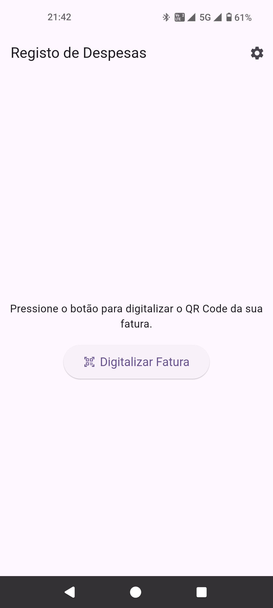
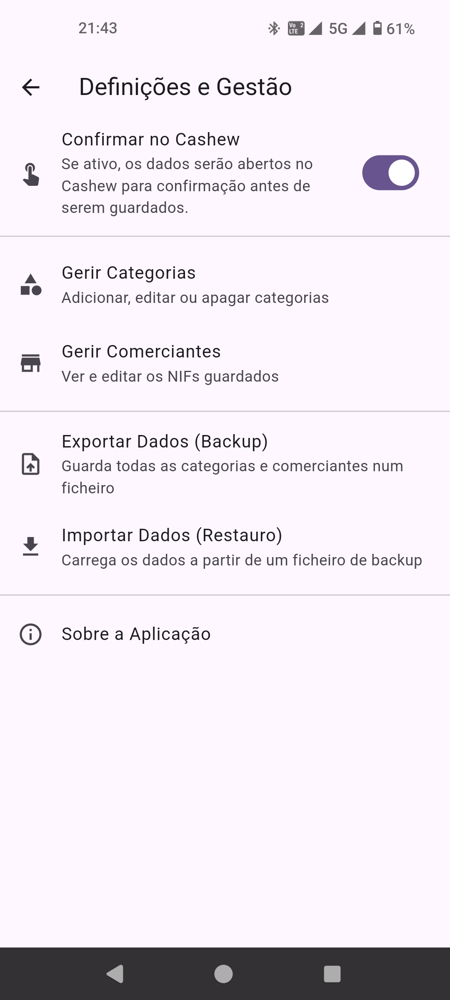
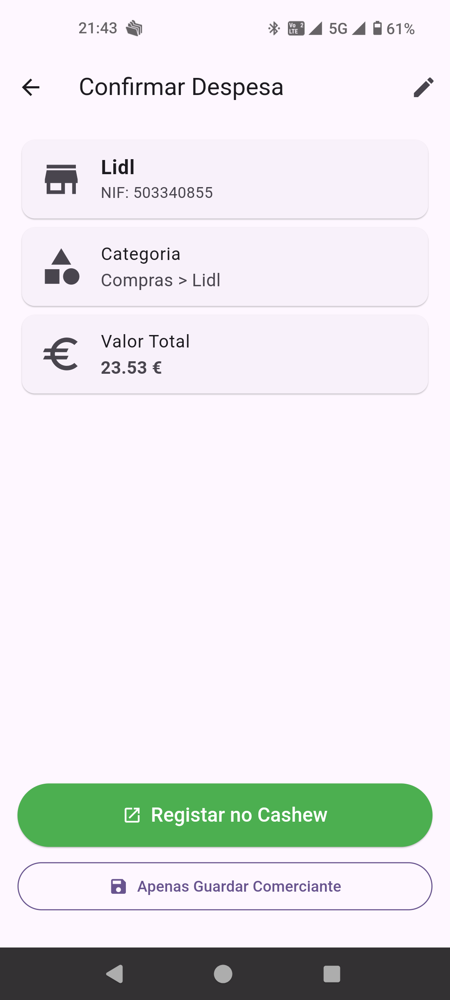
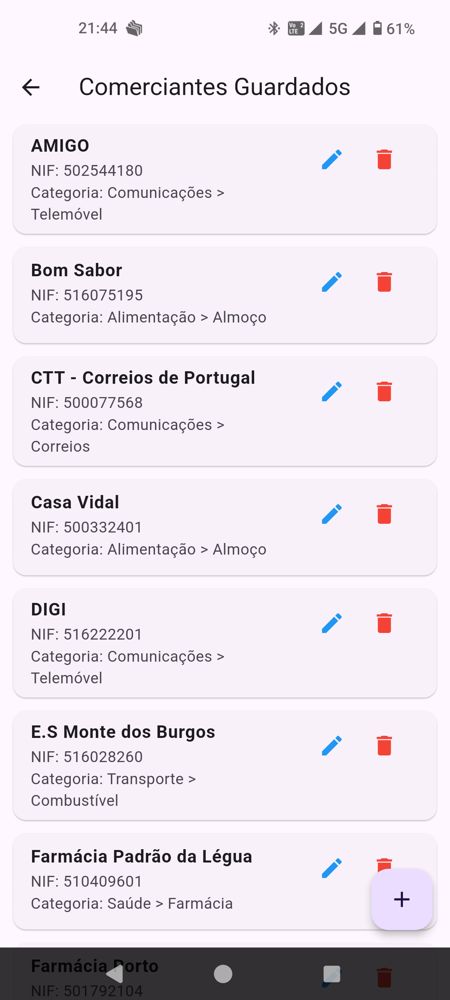
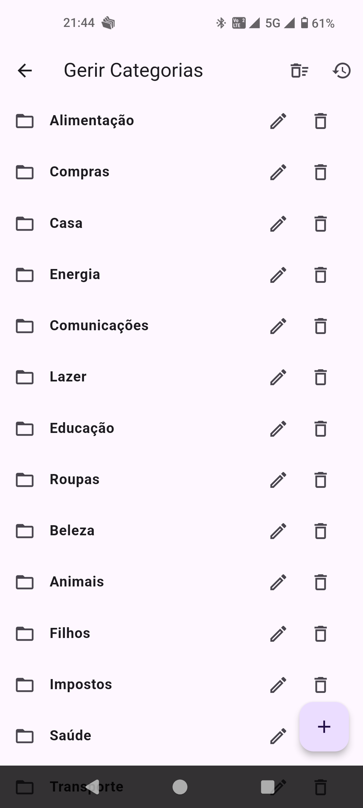
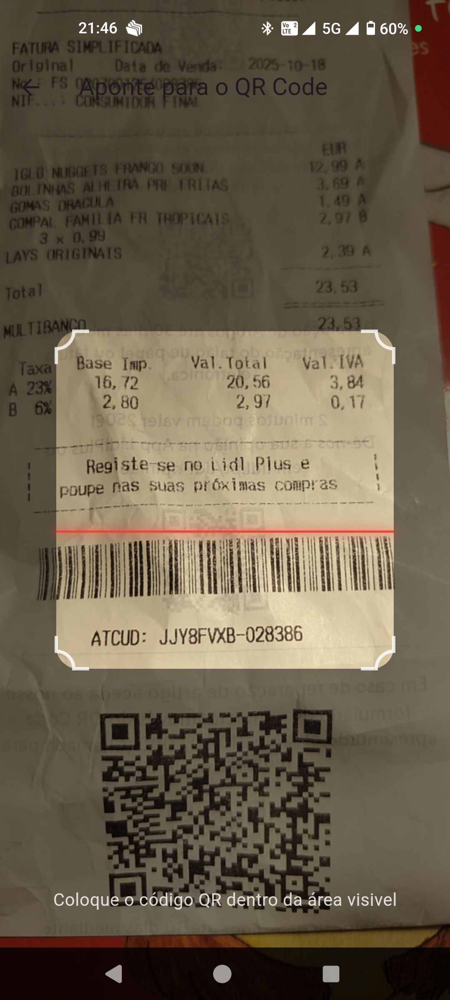

<h1 align="center">
  
  CajuScan
</h1>

**CajuScan** é uma aplicação móvel para Android, desenvolvida em Flutter, que simplifica o registo de despesas em Portugal. A aplicação permite digitalizar o QR Code (ATCUD) presente nas faturas portuguesas, extrair automaticamente os dados da transação e enviá-los para a aplicação de gestão financeira [Cashew](https://cashewapp.web.app/ ).

O objetivo é automatizar o processo manual de inserir despesas, poupando tempo e reduzindo erros.

---

## 📸 Screenshots

Apresentação visual das principais funcionalidades da aplicação CajuScan.

<p align="center">
  
  
  
</p>
<p align="center">
  
  
  
</p>

---

## ✨ Funcionalidades Principais

*   **Leitura de QR Code de Faturas:** Utiliza a câmara do telemóvel para digitalizar e processar instantaneamente os QR Codes das faturas emitidas em Portugal.
*   **Integração com Cashew:** Envia os dados da fatura (valor, data, NIF do comerciante) diretamente para a aplicação Cashew, pré-preenchendo uma nova transação.
*   **Gestão Inteligente de Comerciantes:**
    *   Guarda automaticamente o NIF de cada comerciante.
    *   Permite associar um nome personalizado (ex: "Continente") e uma categoria/subcategoria padrão a cada NIF.
    *   Na leitura seguinte de uma fatura do mesmo comerciante, sugere automaticamente o nome e a categoria guardados.
*   **Gestão de Categorias:**
    *   Sistema completo para criar, editar e apagar categorias e subcategorias de despesa.
    *   Permite restaurar uma lista de categorias padrão a qualquer momento.
*   **Flexibilidade no Registo:**
    *   Opção para registar a transação diretamente no Cashew (sem confirmação).
    *   Opção para abrir os dados no Cashew para revisão antes de guardar (requer confirmação).
    *   Possibilidade de apenas guardar um novo comerciante a partir de um QR Code, sem criar uma transação.
*   **Backup e Restauro:**
    *   Funcionalidade para exportar todos os dados da aplicação (perfis de comerciantes e categorias) para um ficheiro de backup (`.json`).
    *   Permite importar dados a partir de um ficheiro de backup, facilitando a migração entre dispositivos.
*   **Interface Intuitiva:**
    *   Scanner de câmara com uma sobreposição clara para facilitar o alinhamento do QR Code.
    *   Design limpo e focado na simplicidade de uso.

## 🛠️ Tecnologias Utilizadas

*   **Framework:** [Flutter](https://flutter.dev/ )
*   **Linguagem:** [Dart](https://dart.dev/ )
*   **Leitura de QR Code:** [mobile_scanner](https://pub.dev/packages/mobile_scanner )
*   **Armazenamento Local:** [shared_preferences](https://pub.dev/packages/shared_preferences )
*   **Interação com Outras Apps:** [url_launcher](https://pub.dev/packages/url_launcher )
*   **Seleção de Ficheiros (Backup/Restauro):** [file_picker](https://pub.dev/packages/file_picker )
*   **Informação da Aplicação:** [package_info_plus](https://pub.dev/packages/package_info_plus )

## 🚀 Como Compilar e Instalar

Para compilar o projeto, precisa de ter o [Flutter SDK](https://docs.flutter.dev/get-started/install ) instalado e configurado.

1.  **Clonar o repositório:**
    ```sh
    git clone https://github.com/marotoweb/cajuscan.git
    cd cajuscan
    ```

2.  **Instalar as dependências:**
    ```sh
    flutter pub get
    ```

3.  **Executar em modo de depuração:**
    Ligue um dispositivo Android ou inicie um emulador e execute:
    ```sh
    flutter run
    ```

4.  **Compilar a versão de produção (Release APK ):**
    Para gerar o ficheiro `.apk` final, otimizado e pronto para ser instalado:
    ```sh
    flutter build apk --release
    ```
    O ficheiro de instalação será gerado em `build/app/outputs/flutter-apk/app-release.apk`.

## 📄 Licença e Isenção de Responsabilidade

Este projeto é disponibilizado sob a licença MIT.

A aplicação **CajuScan** é fornecida "COMO ESTÁ", sem garantias de qualquer tipo. O autor não se responsabiliza por qualquer mau funcionamento, perda de dados ou erros de registo que possam surgir do uso desta aplicação. É da exclusiva responsabilidade do utilizador verificar a correção dos dados.

---

Desenvolvido por **Rob Cc** com IA.
