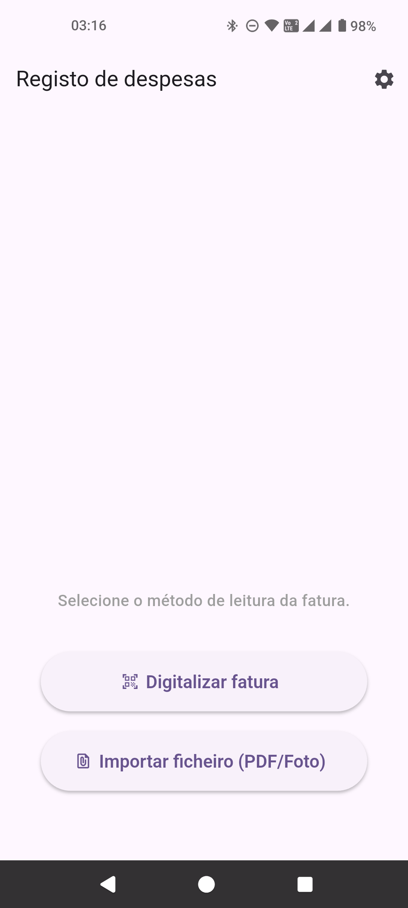
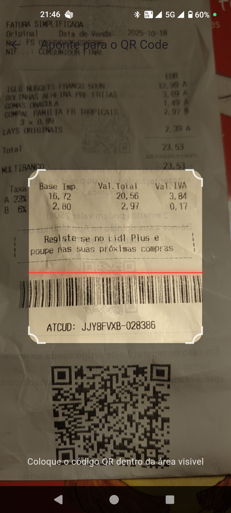
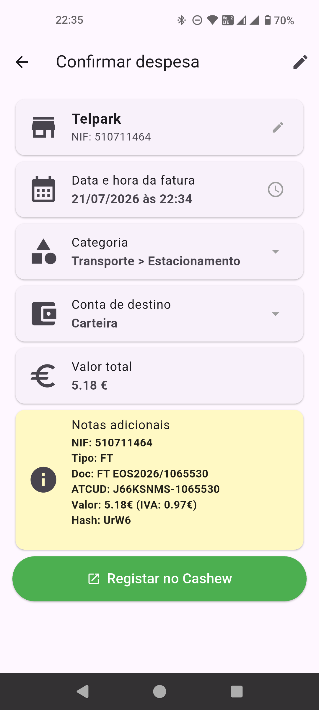
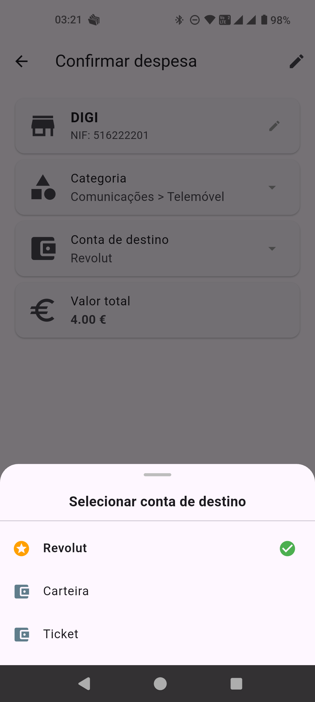
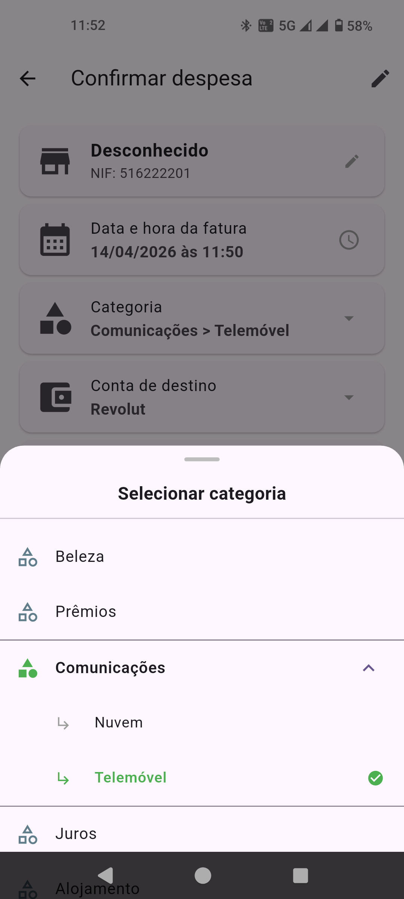
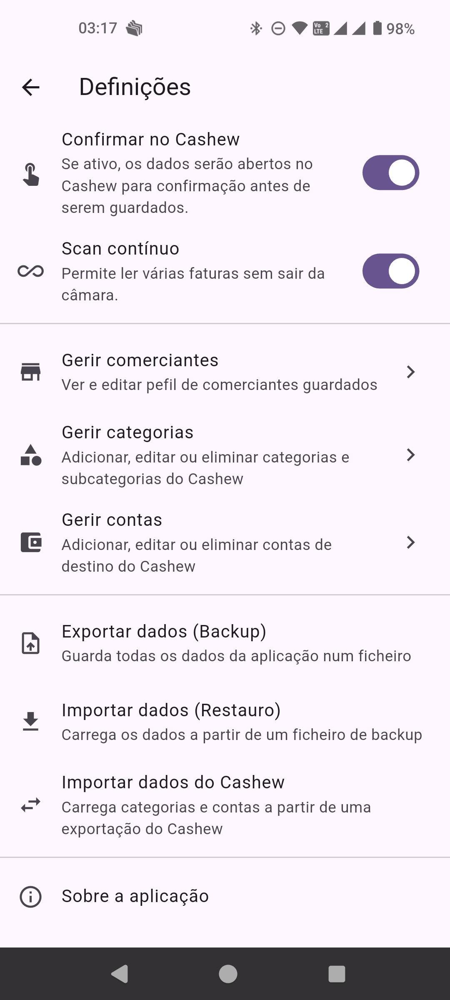
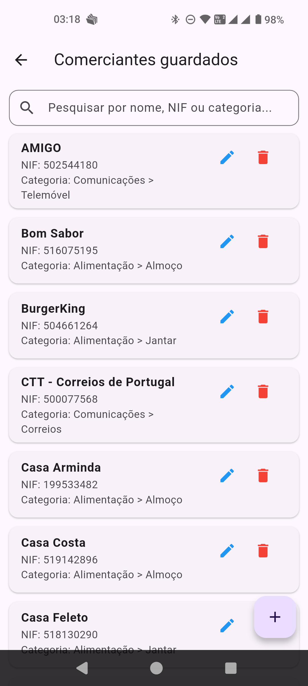
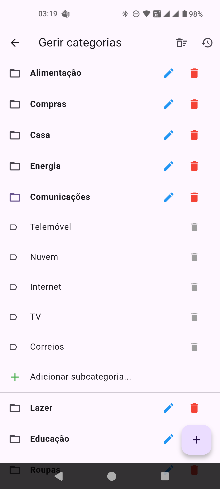
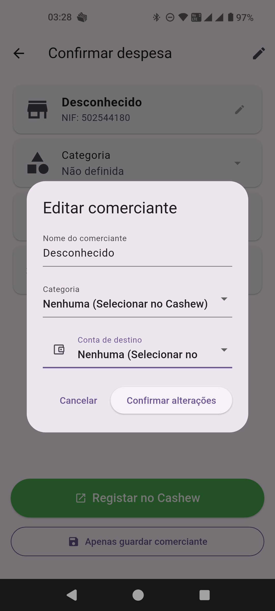

[![GitHub Latest Release][releases_shield]][latest_release]
[![GitHub All Releases][downloads_total_shield]][releases]
<a href="https://www.buymeacoffee.com/marotoweb" target="_blank"></a>

[](https://f-droid.org/pt/packages/com.marotoweb.cajuscan_app)

[latest_release]: https://github.com/marotoweb/cajuscan/releases/latest
[releases_shield]: https://img.shields.io/github/release/marotoweb/cajuscan.svg?style=popout
[releases]: https://github.com/marotoweb/cajuscan/releases
[downloads_total_shield]: https://img.shields.io/github/downloads/marotoweb/cajuscan/total

<h1 align="center">
  
  CajuScan
</h1>

**CajuScan** é uma aplicação móvel para Android, desenvolvida em Flutter, que simplifica o registo de despesas em Portugal. A aplicação permite digitalizar o QR Code (ATCUD) presente nas faturas portuguesas, extrair automaticamente os dados da transação e enviá-los para a aplicação de gestão financeira [Cashew](https://cashewapp.web.app/).

> 💡 **O que é o Cashew?**
> O [Cashew](https://github.com/jameskokoska/Cashew) é uma aplicação de finanças pessoais ~~de código aberto~~, focada na privacidade, que permite gerir orçamentos, contas e despesas de forma local. O CajuScan funciona como um assistente especializado para utilizadores do Cashew em Portugal, automatizando a inserção manual de faturas.

O objetivo é poupar tempo e reduzir erros no preenchimento de transações do dia a dia.

---

## 📸 Screenshots

Apresentação visual das principais funcionalidades da aplicação CajuScan.

<p align="center">
  
  
  
</p>
<p align="center">
  
  
  
</p>
<p align="center">
  
  
  
</p>

---

## ✨ Funcionalidades principais

* **Leitura de código QR de faturas:** Utiliza a câmara do telemóvel para digitalizar e processar instantaneamente os códigos QR (ATCUD) das faturas emitidas em Portugal.
* **Importação de ficheiros:** Permite ler o código QR diretamente de ficheiros **PDF** ou **imagens** da galeria, facilitando o registo de faturas digitais recebidas por email.
* **Integração com Cashew:** Envia os dados da fatura (valor, data, NIF do comerciante) diretamente para a aplicação Cashew, pré-preenchendo uma nova transação. Suporta a inclusão opcional de metadados fiscais adicionais nas notas.
* **Motor de Predição de Contas Dinâmico:** Algoritmo inteligente que analisa o histórico local para sugerir a conta de destino mais provável. Utiliza uma lógica de dupla camada: associa a conta mais frequente para aquele comerciante e recorre à conta mais utilizada globalmente como alternativa, ordenando o menu com base nos seus hábitos.
* **Interface de confirmação moderna:** O ecrã de revisão foi redesenhado para uma navegação consistente baseada em cartões interativos. O toque no comerciante abre um diálogo de edição rápida do nome, permite ajustar a data e hora da transação (com seletores regionais em formato 24h) e apresenta painéis inferiores (*bottom sheets*) integrados para seleção de categoria e conta.
* **Gestão inteligente de comerciantes:**
    * Guarda automaticamente o NIF de cada comerciante.
    * Permite associar um nome personalizado (ex: "Comerciante XPTO") e uma categoria/subcategoria padrão a cada NIF.
    * Na leitura seguinte de uma fatura do mesmo comerciante, sugere automaticamente o nome e a categoria guardados.
    * Barra de pesquisa dinâmica na listagem de comerciantes que permite filtrar instantaneamente por nome, NIF, categoria ou subcategoria.
* **Gestão de categorias e contas:**
    * Áreas dedicadas nas definições para adicionar, editar ou eliminar categorias, subcategorias e contas de destino de forma isolada.
    * Permite restaurar uma lista de categorias padrão a qualquer momento.
    * Importa estruturas de categorias e contas de destino diretamente do Cashew através da funcionalidade de partilha do sistema (*share intent*), ou manualmente a partir de ficheiros estruturados em formato JSON/TXT.
* **Flexibilidade no registo:**
    * Opção para registar a transação diretamente no Cashew (sem confirmação).
    * Opção para abrir os dados no Cashew para revisão antes de guardar (requer confirmação).
    * Possibilidade de apenas guardar o perfil de um novo comerciante a partir do código QR, sem ser necessário gerar uma transação.
* **Backup e restauro:** Funcionalidade para exportar e importar todos os dados da aplicação (perfis de comerciantes, categorias, contas e histórico de predição) através de um único ficheiro `.json` com nomeação cronológica automática (`cajuscan-AAAA-MM-DD-HH-MM-SS.json`), facilitando a migração entre dispositivos.
* **Interface intuitiva:**
    * Scanner de câmara com uma sobreposição clara para facilitar o alinhamento do QR Code.
    * Design limpo e focado na simplicidade de uso.
* **Privacidade e Segurança:** Aplicação inteiramente de código aberto (FOSS) com processamento local e offline, sem telemetria ou servidores externos. Aplicação assinada digitalmente e preparada para compilações reprodutíveis (**Reproducible Builds**).

---

## 🛠️ Tecnologias utilizadas

*   **Framework:** [Flutter](https://flutter.dev/)
*   **Linguagem:** [Dart](https://dart.dev/)
*   **Leitura de código QR:** [flutter_zxing](https://pub.dev/packages/flutter_zxing)
*   **Processamento de PDF:** [native_pdf_renderer](https://pub.dev/packages/native_pdf_renderer)
*   **Armazenamento local:** [shared_preferences](https://pub.dev/packages/shared_preferences)
*   **Interação com outras apps:** [url_launcher](https://pub.dev/packages/url_launcher)
*   **Seleção de ficheiros:** [file_picker](https://pub.dev/packages/file_picker)
*   **Informação da aplicação:** [package_info_plus](https://pub.dev/packages/package_info_plus )
*   **Recepção de intents:** [receive_sharing_intent](https://pub.dev/packages/receive_sharing_intent)
*   **Localização:** [flutter_localizations](https://api.flutter.dev/flutter/flutter_localizations/flutter_localizations-library.html)

---

## 🚀 Como compilar e instalar

Para compilar o projeto, precisa de ter o [Flutter SDK](https://docs.flutter.dev/get-started/install ) instalado e configurado.

1.  **Clonar o repositório:**
    ```sh
    git clone https://github.com/marotoweb/cajuscan.git
    cd cajuscan
    ```

2.  **Instalar as dependências:**
    ```sh
    flutter pub get
    ```

3.  **Executar em modo de depuração:**
    Ligue um dispositivo Android ou inicie um emulador e execute:
    ```sh
    flutter run
    ```

4.  **Compilar a versão de produção (Release APK ):**
    Para gerar o ficheiro `.apk` final, otimizado e pronto para ser instalado:
    ```sh
    flutter build apk --release
    ```
    O ficheiro de instalação será gerado em `build/app/outputs/flutter-apk/app-release.apk`.
    *Nota: Para gerar uma build assinada idêntica à oficial, é necessário configurar as variáveis de ambiente da Keystore.*

---

## 📄 Licença e isenção de responsabilidade

Este projeto é disponibilizado sob a licença **MIT**.

A aplicação **CajuScan** é fornecida "COMO ESTÁ", sem garantias de qualquer tipo. O autor não se responsabiliza por qualquer mau funcionamento, perda de dados ou erros de registo que possam surgir do uso desta aplicação. É da exclusiva responsabilidade do utilizador verificar a correção dos dados.

---
